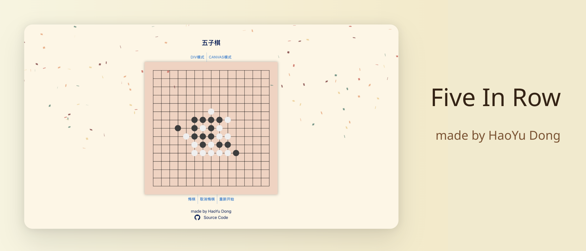

# FirCDC

A Five In A Row game - 五子棋, which is a personal project for CDC.

[fir.szuhy.xyz](https://fir.szuhy.xyz)

HAVE FUN！
## Setup

- Insall [Node.js](https://nodejs.org/en/) >=v16 and [pnpm](https://pnpm.io/)
- Run `pnpm install`
- Run `pnpm dev` and visit `http://localhost:5173`

## Tech Stack

- [React](https://react.dev/)
- [Vite](https://vitejs.dev/)
## Structure
```
├─ .gitignore           
├─ LICENSE              
├─ README.md            # Project documentation file
├─ index.html           
├─ package.json        
├─ pnpm-lock.yaml       
├─ public               # static resource files
├─ src                 
│  ├─ components        # common components of the application
│  ├─ constants         # constants or configuration in the application
│  ├─ helper            # some helper functions or utility classes
│  ├─ hooks             # React Hooks
│  ├─ styles            # global styles of the application
│  ├─ types             # TypeScript type definition files
│  └─ vite-env.d.ts     
├─ tsconfig.json        
├─ tsconfig.node.json   
└─ vite.config.ts  
    
```
## License

[MIT](./LICENSE) License © 2021-PRESENT [Anthony Fu](https://github.com/antfu)
